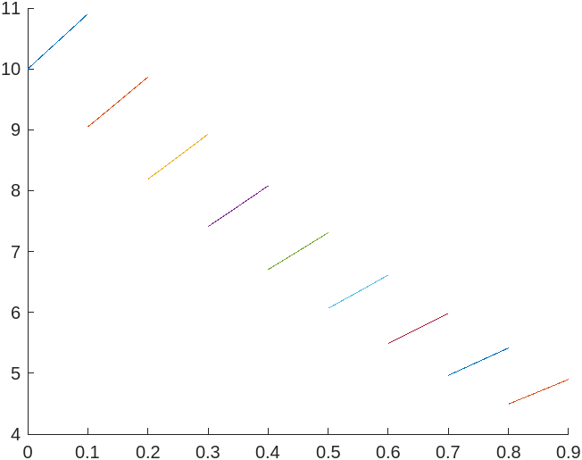

# Homework 12
## Author: Jose R Vasquez Perez

```matlab

n = 10;

% X values where x0 = 0, and xn = 1 where n=10
xf = [0 0.1 0.2 0.3 0.4 0.5 0.6 0.7 0.8 0.9 1];

% calculate yf values using x values with function: f(x) = e^-x
yf = [];
for i=1:n
    yf_value = exp(-xf(i));
    yf = [yf yf_value];
end

% calculating h values

hf = [];
for i=1:n
    hf_value = xf(i + 1) - xf(i);
    hf = [hf hf_value];
end

% matrix A

A = zeros(8, 8);
for row=1:n-2
    for col=1:n-2
        if row==col
            A(row, col) = 2 * (hf(row + 2) + hf(row + 1));
        elseif col==row+1
            A(row, col) = hf(row + 2);
        elseif col == row-1
            A(row, col) = hf(row + 1);
        end
    end
end

% print matrix A and F
fprintf("Matrix A: ")
A

fprintf("Vector F: ")
F = yf(1, 1:8).'

% calc matrix Z 
fprintf("Vector Z: ")
z = A\F;
z = [0, z.', 0];
z

% Calculate interpolation to plug in
Sf = [];
syms x
for i=1:n-1
    Sf_value = ((( z(i)/( 6*hf(i) ) )*(xf(i+1) - x)^3));
    Sf_value1 = ((( z(i+1)/( 6*hf(i) ) )*( x - xf(i))^3));
    Sf_value2 = (((yf(i + 1)/hf(i)) - ((z(i+1)*hf(i))/6))*(x - xf(i)));
    Sf_value3 =  (( yf(i)/hf(i) ) -  ((z(i)*hf(i))/6)*(xf(i+1) - x));
    Sf = [Sf Sf_value+Sf_value1+Sf_value2+Sf_value3];
end

Sf

hold on
fplot(Sf(1),[0, 0.1]);
fplot(Sf(2),[0.1, 0.2]);
fplot(Sf(3),[0.2, 0.3]);
fplot(Sf(4),[0.3, 0.4]);
fplot(Sf(5),[0.4, 0.5]);
fplot(Sf(6),[0.5, 0.6]);
fplot(Sf(7),[0.6, 0.7]);
fplot(Sf(8),[0.7, 0.8]);
fplot(Sf(9),[0.8, 0.9]);
hold off


```

# Output

```matlab
Matrix A: 
A =

    0.4000    0.1000         0         0         0         0         0         0
    0.1000    0.4000    0.1000         0         0         0         0         0
         0    0.1000    0.4000    0.1000         0         0         0         0
         0         0    0.1000    0.4000    0.1000         0         0         0
         0         0         0    0.1000    0.4000    0.1000         0         0
         0         0         0         0    0.1000    0.4000    0.1000         0
         0         0         0         0         0    0.1000    0.4000    0.1000
         0         0         0         0         0         0    0.1000    0.4000

Vector F: 
F =

    1.0000
    0.9048
    0.8187
    0.7408
    0.6703
    0.6065
    0.5488
    0.4966

Vector Z: 
z =

         0    2.1566    1.3736    1.3974    1.2242    1.1140    1.0229    0.8597    1.0265         0

 
Sf =
 
[(8093720221926357*x^3)/2251799813685248 + (1268386880704305*x)/140737488355328 + 10, (1181796071330726117*x)/144115188075855872 - (8093720221926357*(x - 1/5)^3)/2251799813685248 + (2577558003524349*(x - 1/10)^3)/1125899906842624 + 5926552707779826587/720575940379279360, (2135148910174403197*x)/288230376151711744 + (5244361239025749*(x - 1/5)^3)/2251799813685248 - (1288779001762175*(x - 3/10)^3)/562949953421312 + 19321410923826271113/2882303761517117440, (30201530287081203*x)/4503599627370496 - (5244361239025747*(x - 2/5)^3)/2251799813685248 + (4594401657504675*(x - 3/10)^3)/2251799813685248 + 60731347043780399/11258999068426240, (1748734835891309665*x)/288230376151711744 - (2297200828752339*(x - 1/2)^3)/1125899906842624 + (2090468826358853*(x - 2/5)^3)/1125899906842624 + 2463967944680332959/576460752303423488, (1582279578342027909*x)/288230376151711744 + (7677913955667005*(x - 1/2)^3)/4503599627370496 - (2090468826358853*(x - 3/5)^3)/1125899906842624 + 4782653263873103217/1441151880758558720, (1432093853852960385*x)/288230376151711744 + (3226328211536589*(x - 3/5)^3)/2251799813685248 - (7677913955667005*(x - 7/10)^3)/4503599627370496 + 7220941442732373369/2882303761517117440, (2588601796402296297*x)/576460752303423488 - (6452656423073171*(x - 4/5)^3)/4503599627370496 + (3852629174433885*(x - 7/10)^3)/2251799813685248 + 1312215225700546071/720575940379279360, (73549289058271191*x)/18014398509481984 - (3852629174433889*(x - 9/10)^3)/2251799813685248 + 220736579345911921/180143985094819840]
 
>> 
```

Name: plot_cubic_spline.fig

